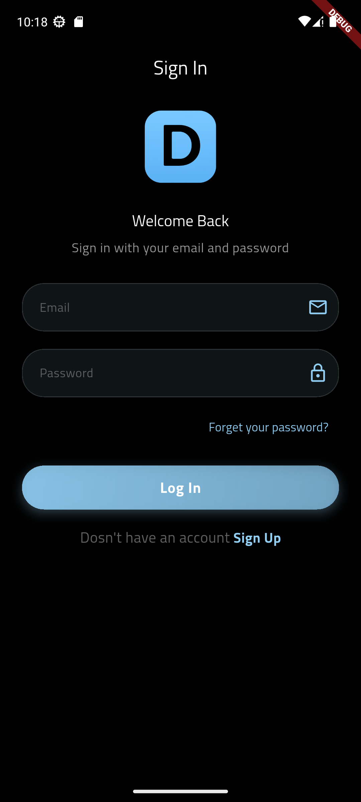
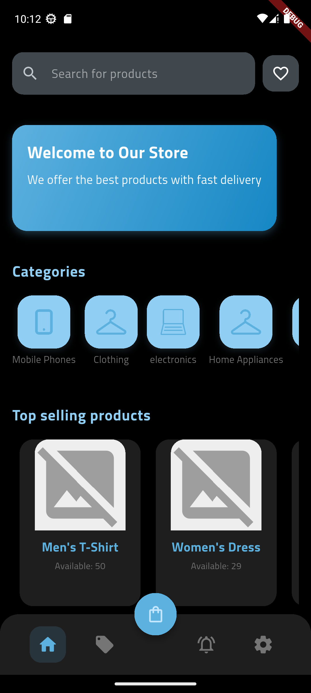
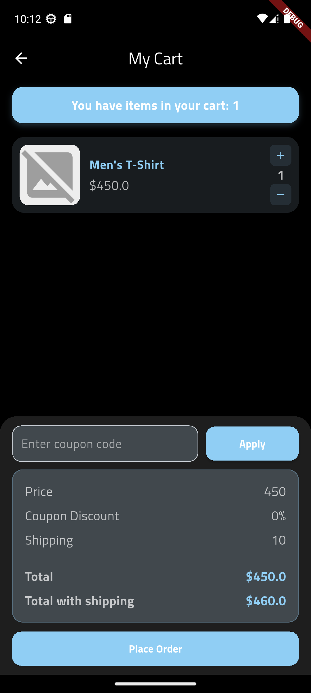
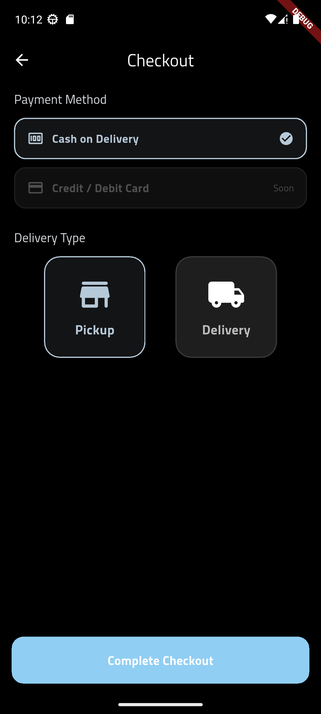
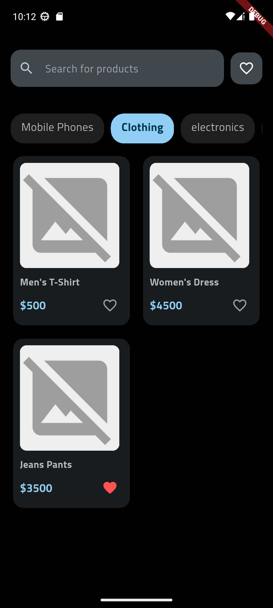
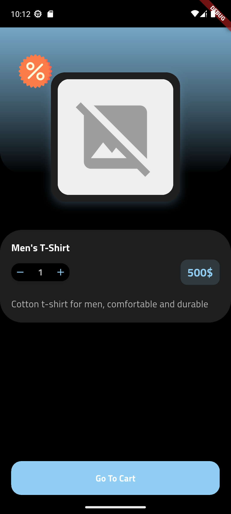
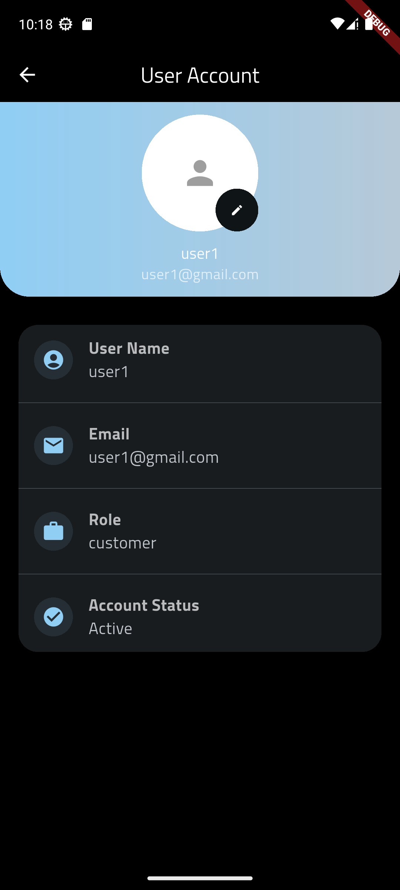

# Ecommerce Customer App (Flutter)

Customer mobile application for a multi-role ecommerce system.

## Features
- User registration & login
- Product browsing
- Cart & checkout
- Order history
- API integration

## Tech Stack
- Flutter
- Dart
- REST API
- GetX

## Screenshots

## Related Repositories
- Backend API:[link](https://github.com/osamajmt/ecommerce-api-laravel)
- Driver App: [link](https://github.com/osamajmt/ecommerce-delivery-flutter)
- Admin App: [link](https://github.com/osamajmt/ecommerce-admin-flutter)
